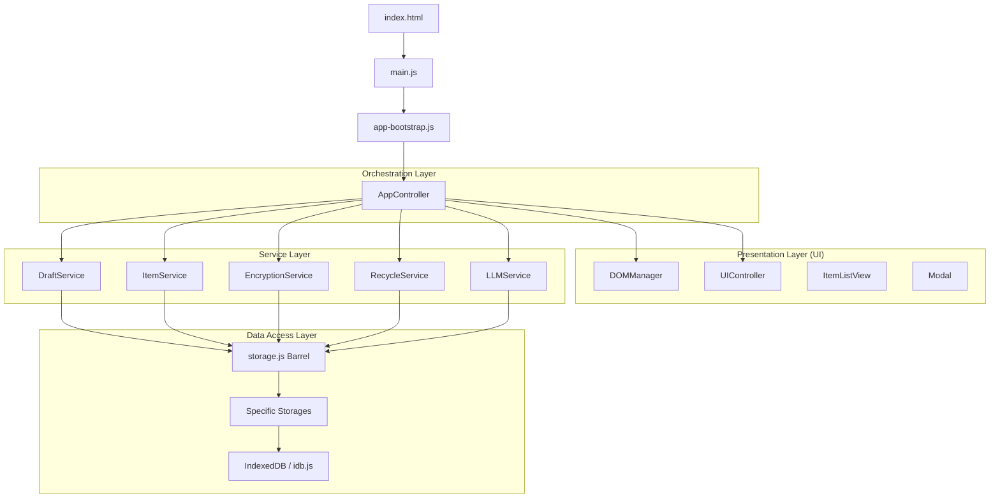

# 🏗️ 架构设计深度解析 (Architecture Deep Dive)

Temp Notes 采用了经典的**分层架构 (Layered Architecture)**，并结合了**面向服务 (Service-Oriented)** 的设计模式，以确保在高频率交互下的稳定性和可扩展性。

## 📐 整体架构图

---

## 📂 分层职责详解

### 1. 入口与引导层 (Bootstrap Layer)
*   **职责**: 负责环境检测、依赖注入和应用生命周期的启动。
*   **核心模块**: `js/bootstrap/app-bootstrap.js`。它将 `UIController`、`DOMManager` 注入到 `AppController` 中，并完成事件绑定。

### 2. 编排层 (Orchestration Layer)
*   **职责**: 作为整个应用的中枢神经系统，持有所有 Service 的引用。它不直接处理具体业务，而是协调不同 Service 之间的调用。
*   **核心模块**: `js/app-controller.js`。

### 3. 服务层 (Service Layer)
*   **职责**: 实现具体的业务规则。例如，`DraftService` 负责草稿的防抖保存、存档逻辑以及与录音附件的关联。
*   **单一职责**: 每一个 Service 只关注一个业务领域。

### 4. 表现层 (Presentation Layer)
*   **职责**: 封装 DOM 操作。
    *   `DOMManager`: 唯一的 DOM 引用池。
    *   `UIController`: 处理全局 UI 反馈（Toast）。
    *   `View 模块`: 负责复杂片段（如条目列表）的渲染。

### 5. 数据访问层 (Data Access Layer)
*   **职责**: 处理持久化存储。
*   **技术选型**: **IndexedDB**。
    *   **Store Settings**: 存储应用配置。
    *   **Store Items**: 存储所有已存档笔记。
    *   **Store Recycle**: 存储已删除但可恢复的笔记。
    *   **Store Recordings**: 存储二进制录音数据。

---

## 🔄 数据流向示例 (Data Flow)

### 场景：存档草稿
1.  用户点击“存档”按钮。
2.  `bind-events.js` 触发 `appController.archiveDraft()`。
3.  `AppController` 调用 `DraftService.archiveDraft()`。
4.  `DraftService` 读取 `DOMManager` 中的文本，生成 `Item` 对象。
5.  `DraftService` 调用 `ItemStorage.saveItem()`。
6.  `ItemStorage` 通过 `idb.js` 写入 IndexedDB。
7.  成功后，`AppController` 通知 `UIController` 显示“已存档”提示，并命令 `ItemListView` 刷新列表。

---

## 🔐 安全与加密架构

*   **算法**: 基于 CryptoJS 的 AES 对称加密。
*   **策略**: “零知识”原则。除非用户输入正确密码，否则加密后的笔记在 IndexedDB 中以密文存储，且标题会经过脱敏处理。
*   **自动解密**: 针对默认密码 (`password`)，应用会自动尝试解密以提升体验。

---

## 📈 性能优化方案

1.  **防抖 (Debounce)**: 草稿保存采用 250ms 防抖，避免频繁的 I/O。
2.  **增量更新**: 修改条目时，仅更新对应的 Object Store 项，不重写整个库。
3.  **懒加载渲染**: 只有当视图进入或数据变化时才重新生成 DOM 节点。

---

**更新时间**: 2026-05-22  
**架构版本**: v1.2.0 (Modularized + IndexedDB)
